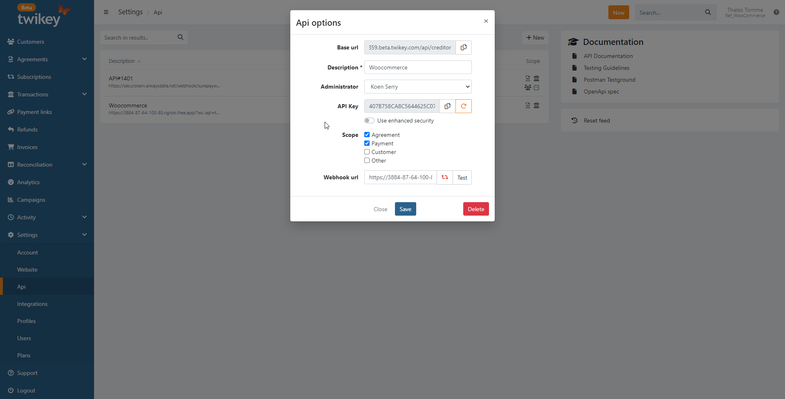
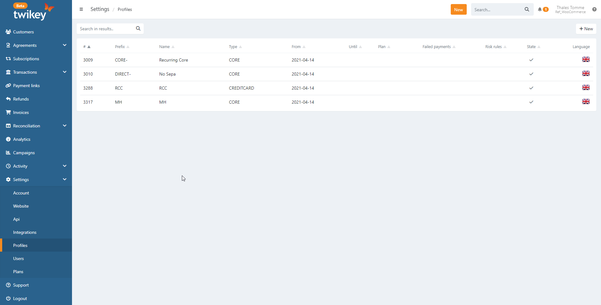

# Wordpress Woocommerce v3.x

## Accept payments via Twikey

Via Twikey you can handle your one time customers via your favorite PSP 
while still using direct debit via your bank. This plugin is fully integrated with your 
Twikey portal to receive fast feedback on payments or refusals.

## Features

This plugin allow both the woocommerce subscription plugin as well as standalone 
where subscriptions are being handled from within Twikey  

## Installation & Configuration

### Step 1
Download the Twikey plugin on https://github.com/twikey/woocommerce-3.x

### Step 2 : Install the plugin

Within your Wordpress environment choose "plugin > add new > Upload Plugins"
and upload the zip. And activate the plugin.

## Step 3 : Activate the plugin

Configure the plugin in "WooCommerce > Settings > Payments".
Activate both Twikey methods and choose "Manage Twikey"

## Step 4: Plugin configuration

1. Enable Twikey Sandbox for testing via Twikey Beta
2. ** Fill in the API key ** (see step 5)
3. ** Fill in the Website key ** (see step 6)
4. ** Fill in the Template ID ** (see setp 7)
5. Fill in the description for your customers

## Step 5: Api key [Twikey]

The api key allow you to talk to our api.

1. Via [Settings > API](https://www.twikey.com/r/admin#/c/settings/ei)
2. Choose own integration
3. API token = API key for plugin

## Step 6: Website key [Twikey]

The website key allows the plugin to verify that incoming requests are coming from us.

1. Via [Settings > Website](https://www.twikey.com/r/admin#/c/settings/ip)
2. Private key = website key for Plugin

## Step 7: Choose your template

 1. Via [Settings > templates](https://www.twikey.com/r/admin#/c/contracttemplate)
 3. Choose the template number you want to connect to your Woocommerce store

## Step 8

Repeat steps 4 to 7 for the payment gateway plugin.
